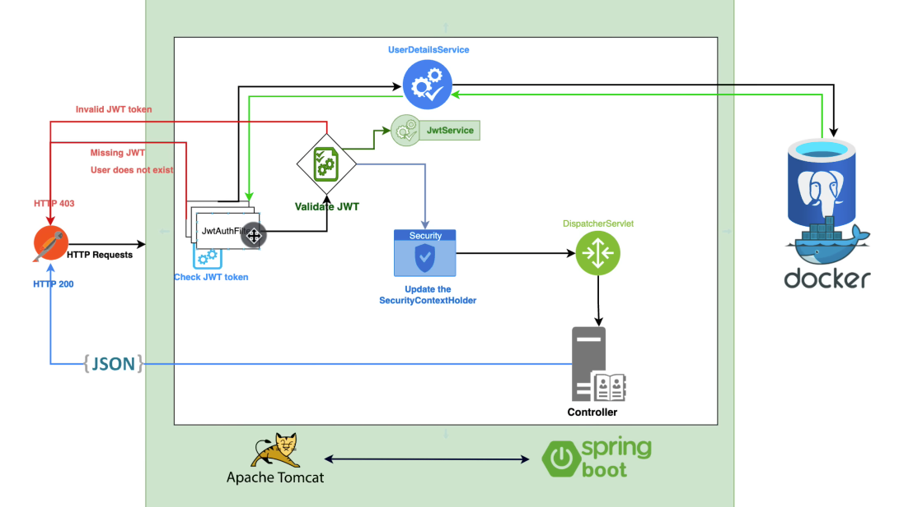

## Exercising Spring boot JWT

---

> JWT 사용 예제
> [ref Spring Boot 3 + Spring Security 6 - JWT Authentication and Authorisation [NEW] [2023]](https://www.youtube.com/watch?v=KxqlJblhzfI&t=22s) > [ref Spring Boot 에서 Spring Security 기반 JWT 적용하기](https://velog.io/@soyeon207/JWT-%EC%8B%A4%EC%8A%B5) > [ref blog source](https://github.com/soyeon207/blog_example/blob/master/jwt-security-server/src/main/java/velog/soyeon/jwt/entity/Users.java)

---
