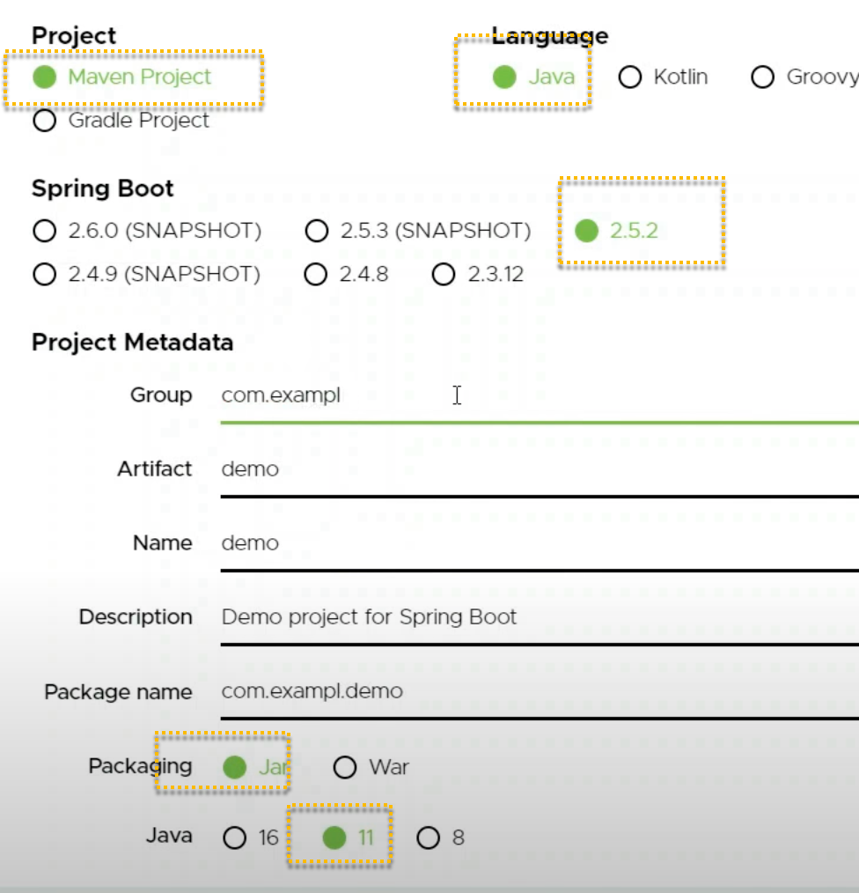

## React - SpringBoot - MySQL
### 1. 프로젝트 소개
- React와 SpringBoot를 이용한 게시판 프로젝트입니다.
[ref Full Stack web application using Spring Boot and React | REST API | MySQL | React Hooks](https://www.youtube.com/watch?v=O_XL9oQ1_To)

---
### 2. 프로젝트 구조
- 프로젝트 구조는 다음과 같습니다.

1. React (front-end)

2. SpringBoot (back-end)
   

3. MySQL (database)
   - sqluser/password
